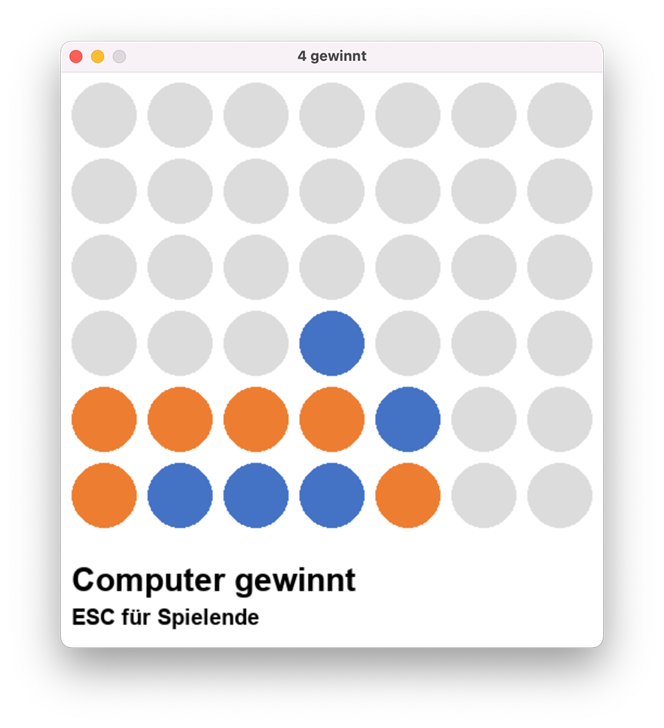

# vierGewinnt - 4Connected

The following python project was my first big endeavour in Python. It was a coursework in our computer science course where we learned python (but no object oriented programming which was subject of our business informatics course).
 
 
I got the task to implement a self-selected, complex algorithm in Python, write a kind of [thesis](doc/thesis.pdf), and [present](doc/presentation.pdf) it to our course ([handout](doc/handout.pdf)). As object-oriented programming was introduced in another course, the course should only use procedural programming. As we are on a German school, all documents and even the coding are in German (so that beginners like us can more easily understand it) - apologies to all non-German speakers out there ;-)
 
 
I wanted to implement a game and selected "four connected". I wanted a graphical user interface which was clickable with the mouse. In addition, there should be a kind of "artificial intelligence" so that I could play against the computer.
 
 
The code implements the [MinMax algorithm](https://en.wikipedia.org/wiki/Minimax) with [alpha-beta-pruning](https://en.wikipedia.org/wiki/Alpha%E2%80%93beta_pruning) to simulate the computer player. For the graphical user interface and game programming support I use [pygame](https://www.pygame.org/news).
 
 

